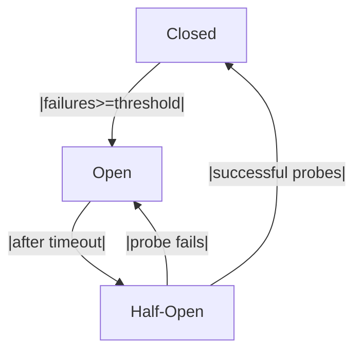

The **Circuit Breaker** pattern is a resilience and fault-tolerance design strategy widely used in distributed systems. In .NET, especially with C#, the pattern helps applications gracefully handle failures when interacting with external services.

## 🔧 What is the Circuit Breaker Pattern?

Borrowed from electrical engineering, the circuit breaker pattern acts like a switch that "trips" when a system or service experiences repeated failures. Instead of continuing to attempt calls to a failing service, the breaker opens and short-circuits subsequent attempts, allowing the system to recover and an alert or fallback to execute.

### Understanding the state machine

At its core, a circuit breaker is a finite state machine with three states:

1. **Closed** – All requests are allowed through. The breaker monitors failures and counts them. When failures exceed a threshold, it transitions to *Open*.
2. **Open** – Calls are blocked for a configured break duration. Every attempt immediately returns a controlled failure (exception or fallback). After the timer expires, the breaker moves to *Half-Open*.
3. **Half-Open** – A small, configurable number of requests are allowed as probes. If they succeed, the breaker resets to *Closed* and clears failure counts. If any probe fails, it returns to *Open* and the cycle restarts.

A simple diagram:


This state machine is the foundation of any from-scratch implementation. Managing concurrency, timers, and failure counts precisely is the main challenge in a robust design.. Managing concurrency, timers, and failure counts precisely is the main challenge in a robust design.

There are three main states:

1. **Closed** – Requests pass through normally.
2. **Open** – New requests fail immediately, usually returning a default value or throwing an exception.
3. **Half-Open** – After a timeout, a limited number of test requests are allowed. If they succeed, the circuit closes; otherwise, it reopens.

## ✅ Why use it in C# .NET?

- Prevents cascading failures across microservices.
- Reduces latency by avoiding calls to known broken endpoints.
- Allows for fallback strategies and alerts.

## 📦 Implementing with Polly

[Polly](https://github.com/App-vNext/Polly) is a lightweight resilience library for .NET. It lets you declare circuit breaker policies using a fluent API, tuning thresholds, break durations, and callbacks. Behind the scenes it manages the state machine for you; a typical policy only needs a few lines of configuration:

```csharp
var breakerPolicy = Policy
    .Handle<Exception>()
    .CircuitBreakerAsync(5, TimeSpan.FromSeconds(30));
```

Once defined, wrap calls (HTTP, database, etc.) with `breakerPolicy.ExecuteAsync(...)`. Polly will open, half‑open, and close automatically based on failures, and you can hook into `onBreak`/`onReset` if you wish.

### Handling the Half-Open State

Polly limits the number of test requests during half‑open and transitions based on their success; you rarely need to manage it manually.

## 🧩 Custom Implementation from Scratch

For learners or when you must avoid external dependencies, you can implement the state machine yourself. The high‑level responsibilities are:

- maintain the current state (Closed/Open/Half‑Open)
- count failures and successes
- enforce a timeout before transitioning from Open to Half‑Open
- protect internal state from concurrent access (e.g. via locks or `Interlocked` operations)

The following reference section at the end of this article contains a complete thread‑safe C# class demonstrating these ideas.


## 📈 Real-world use cases

- Protecting downstream HTTP APIs in microservice architectures
- Safeguarding database connections during outages
- Wrapping third-party payment gateways that may throttle or fail

## 📝 Best Practices

- Tune retry and break thresholds according to SLA requirements.
- Combine circuit breakers with retries and bulkheads for layered resilience.
- Use monitoring/telemetry to track state transitions and failures.

## 🛠️ Testing Tips

- Simulate failures in unit tests by injecting fake dependencies that throw exceptions.
- Assert that the policy opens after expected failures and transitions back correctly.

---

### 📁 Appendix: Reference Implementation

Below is a complete thread-safe C# circuit breaker class combining the ideas discussed above. You can use it as a starting point or drop it into a utilities library.

```csharp
public enum CircuitState { Closed, Open, HalfOpen }

public class BrokenCircuitException : Exception
{
    public BrokenCircuitException() : base("Circuit is open; execution prevented.") { }
}

public class SimpleCircuitBreaker
{
    private readonly object _lock = new object();
    private int _failureCount;
    private int _successCount;
    private DateTime _stateChangedAt = DateTime.UtcNow;

    public int FailureThreshold { get; } = 5;
    public TimeSpan BreakDuration { get; } = TimeSpan.FromSeconds(30);
    public int SuccessThreshold { get; } = 2;
    public CircuitState State { get; private set; } = CircuitState.Closed;

    public T Execute<T>(Func<T> action)
    {
        lock (_lock)
        {
            if (State == CircuitState.Open && DateTime.UtcNow - _stateChangedAt < BreakDuration)
            {
                throw new BrokenCircuitException();
            }
            if (State == CircuitState.Open && DateTime.UtcNow - _stateChangedAt >= BreakDuration)
            {
                State = CircuitState.HalfOpen;
                _successCount = 0;
            }
        }

        try
        {
            var result = action();
            Success();
            return result;
        }
        catch
        {
            Fail();
            throw;
        }
    }

    private void Success()
    {
        lock (_lock)
        {
            if (State == CircuitState.HalfOpen)
            {
                _successCount++;
                if (_successCount >= SuccessThreshold)
                {
                    _failureCount = 0;
                    State = CircuitState.Closed;
                    _stateChangedAt = DateTime.UtcNow;
                }
            }
            else if (State == CircuitState.Closed)
            {
                _failureCount = 0;
            }
        }
    }

    private void Fail()
    {
        lock (_lock)
        {
            _failureCount++;
            _stateChangedAt = DateTime.UtcNow;
            if (_failureCount >= FailureThreshold)
            {
                State = CircuitState.Open;
            }
        }
    }
}
```

---

A properly implemented circuit breaker helps keep your C# .NET applications robust, responsive, and maintainable, especially in distributed or cloud-native environments. Happy coding! 🚀
